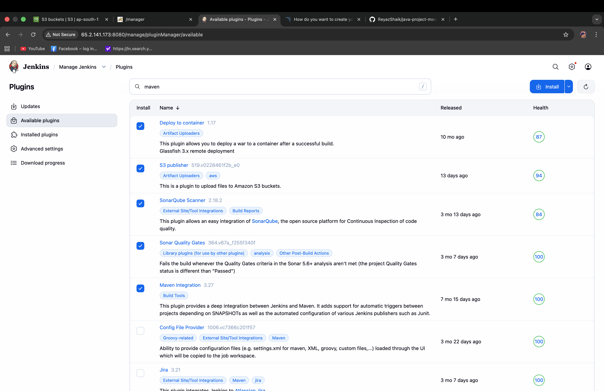
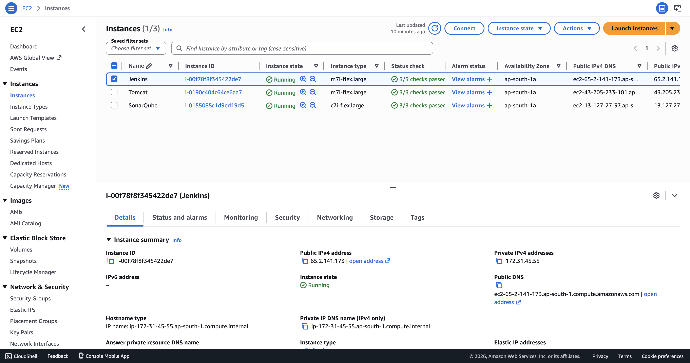
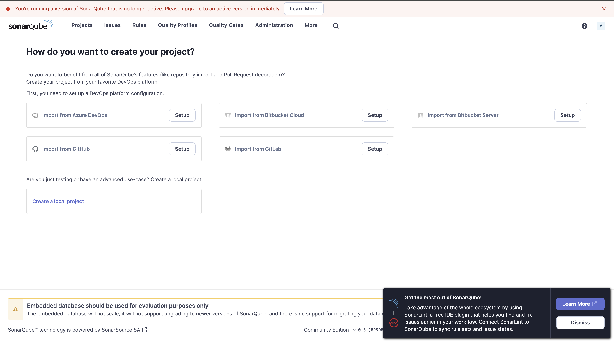
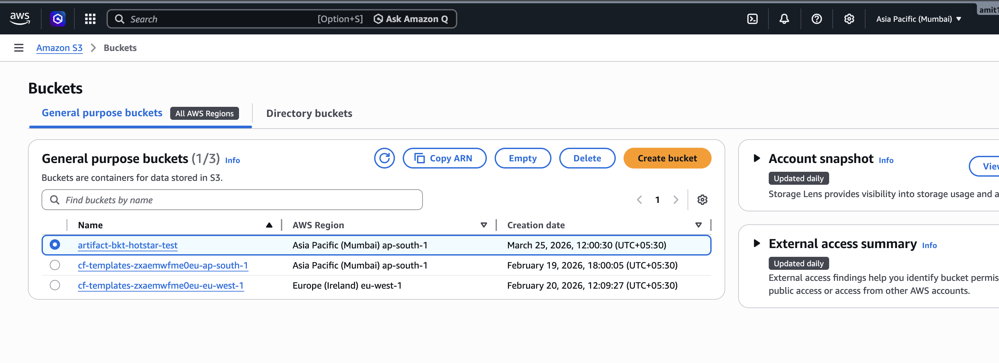
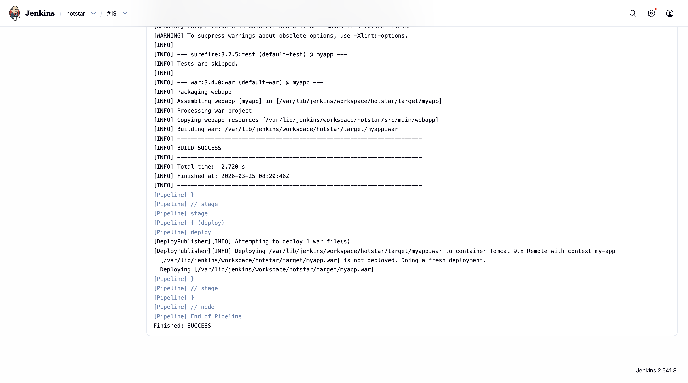
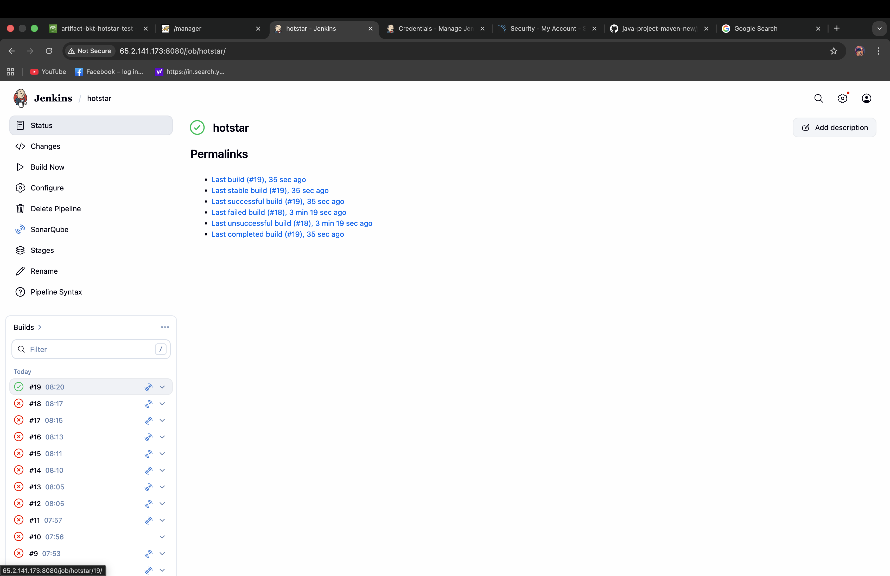
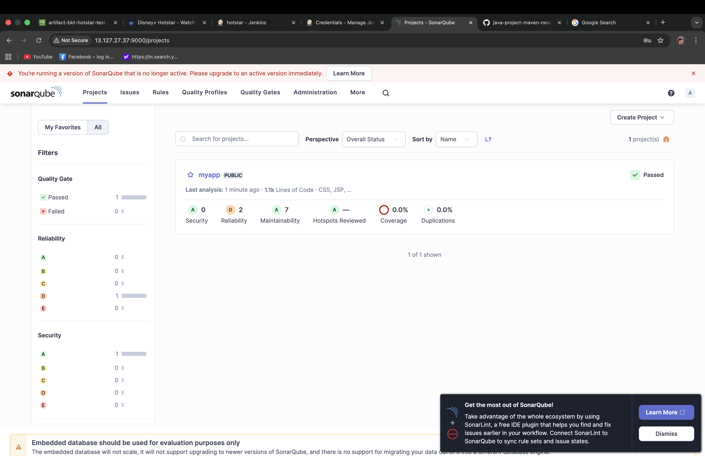
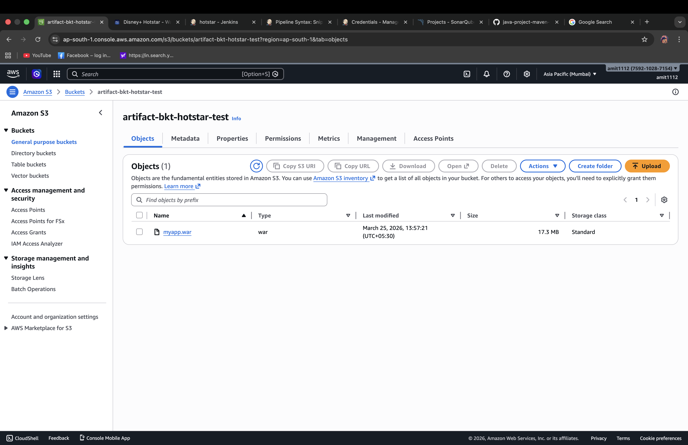
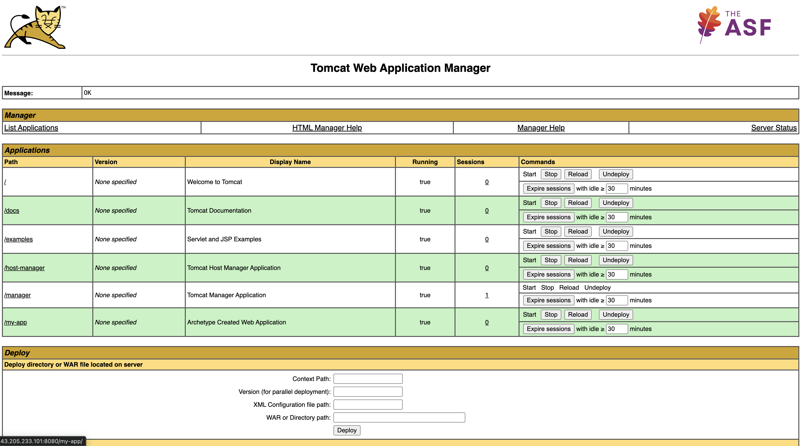

# 🚀 End-to-End CI/CD Pipeline with Jenkins, SonarQube, S3 & Tomcat on AWS

---

## 📌 Project Overview

This project demonstrates a complete DevOps CI/CD pipeline using Jenkins Pipeline, integrating code quality analysis with SonarQube, artifact storage using AWS S3, and deployment to Apache Tomcat on AWS EC2.

The pipeline automates the entire software delivery lifecycle from code integration to deployment and artifact management.

---

## 🎯 Key Features

* Jenkins Pipeline (Pipeline as Code using Jenkinsfile)
* Maven build automation
* SonarQube integration for code quality analysis
* Automated WAR file generation
* Deployment to Apache Tomcat (EC2)
* Artifact storage in AWS S3

---

## 🏗️ Architecture

GitHub → Jenkins → Maven Build → SonarQube Analysis → WAR File →
→ Deploy to Tomcat → Store Artifact in S3

---

## ⚙️ Tech Stack

| Category        | Tools            |
| --------------- | ---------------- |
| Language        | Java             |
| Build Tool      | Maven            |
| CI/CD           | Jenkins Pipeline |
| Code Quality    | SonarQube        |
| Artifact Store  | AWS S3           |
| Server          | Apache Tomcat    |
| Cloud           | AWS EC2          |
| Version Control | GitHub           |

---

## 🔄 Pipeline Workflow

1. Code is fetched from GitHub
2. Maven compiles the project
3. SonarQube performs code quality analysis
4. Unit tests are executed
5. WAR file is generated
6. Application is deployed to Tomcat server
7. Artifact is uploaded to AWS S3

---

## 📸 Screenshots

### 🔹 Installing Plugings in Jenkins

### 🔹 Amazon EC2 Running

### 🔹 Initial SonarQube Dashboard

### 🔹 Jenkins Pipeline Configuration

### 🔹 S3 Bucket 

### 🔹 Jenkins Pipeline Execution

### 🔹 Building Sucess

### 🔹 Building Status

### 🔹 SonarQube Dashboard

### 🔹 S3 Bucket Artifact

### 🔹 Tomcat Dash

### 🔹 Tomcat Deployment

---

## 🧠 Key Learnings

* CI/CD pipeline implementation using Jenkins Pipeline
* Integration of SonarQube for code quality analysis
* Artifact management using AWS S3
* Automated deployment to Tomcat
* Secure credential management in Jenkins

---

## ⚠️ Challenges Faced

* Configuring SonarQube server and token
* Managing AWS credentials securely
* Debugging pipeline failures
* Integrating multiple tools in a single pipeline

---

## 🔐 Security Considerations

* Credentials stored securely in Jenkins
* No sensitive data exposed in repository
* Secure communication between services

---

## 📦 Source Code Reference

Base project used:
https://github.com/ReyazShaik/java-project-maven-new.git

---

## 🚀 Future Enhancements

* Add Docker containerization
* Deploy using Kubernetes
* Implement CI/CD monitoring
* Add automated rollback mechanism

---

## 💼 Resume Highlights

* Designed end-to-end CI/CD pipeline using Jenkins Pipeline
* Integrated SonarQube for automated code quality checks
* Implemented artifact storage using AWS S3
* Automated deployment of Java application on Tomcat (AWS EC2)

---

## 👩‍💻 Author

**Risu Kumari**
DevOps & Cloud Enthusiast

GitHub: https://github.com/rishu-1112

---
